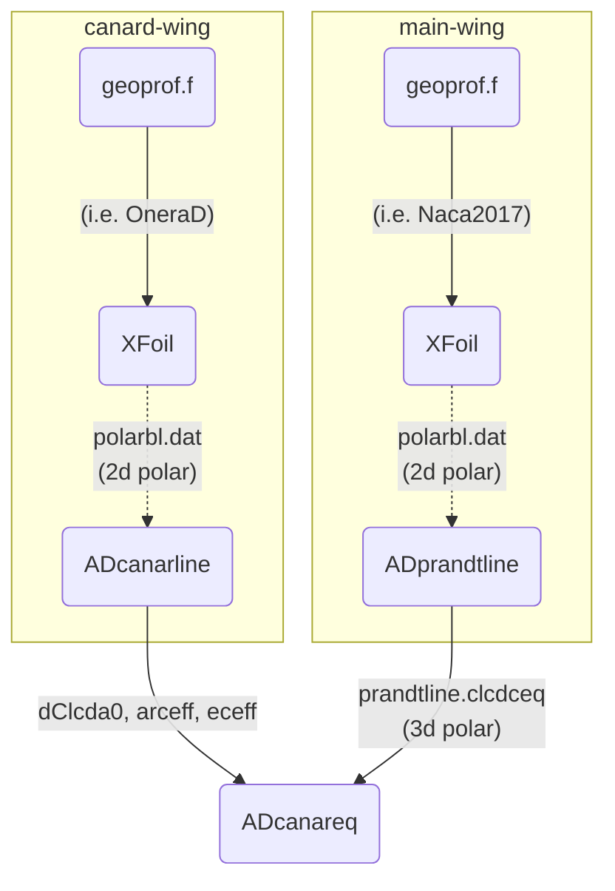
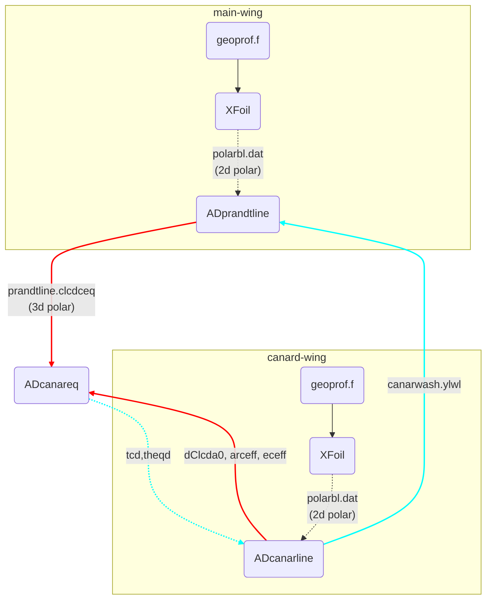
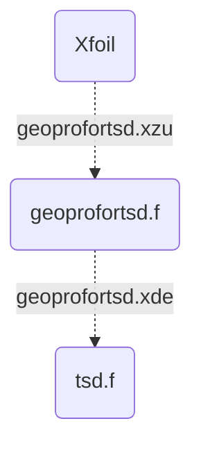

# AeroDesign
The original version of this software was written by Dr. Jean-Jacques Chattot in Fortran.  This C++ implementation has been created with the permission of Dr. Chattot.

The work done herein is based solely on the vortex line method outlined by Professors J.J. Chattot and M.M. Hafez [1].
The point of contact for questions should be directed to Carlos Pereyra.

Follow the sections below for compiling and using this package.

* [Build](#Build)
* [Executables](#Usage)
* [Documentation](#Documentation)
* [References & Citation](#Citation)
## <a name="Build"></a> Build Instructions

Below are the steps required to compile this project.

**step one**, clone the repository
```
git clone https://github.com/Transonic-Integrated-AeroDesign/AeroDes
```

**step two**, change directory into AeroDes
```
cd AeroDes
```

**step three**, make a new build directory and change into it
```
mkdir build 
cd build
```

**step four**, build code with cmake utility and install to your system
```
cmake ../.
make
sudo make install
```

```make``` compiles the code. ```make install``` installs the executables to your system.

### Re-syncing your code with latest stuff
```
git fetch
git pull origin master
```

### Depedencies

In order to compile the executables and the shared libraries, you will need the following packages on your computer.

**Mac OS X**
* cmake https://cmake.org/install/
* g++ https://developer.apple.com/xcode/
  
**Windows**
* WSL 2
* cmake
* g++

## <a name="Usage"></a> Executables to Use

Listed below are the executables for various design tasks. If you have properly installed AeroDes with Cmake then
these executables should be available.

There are two methods of using this code in your design process.
You may either use the direct executables in linear fashion where you run each program separately.
Or you may import the shared library resource. Lets go through both so you know how to use either of these resources.

```
ADcanareq
ADprandtline
ADwake
ADcfmactu
ADtsd
```

Each exectuable will of course require their own input parameters found in their respective examples directory.

See the ```AeroDes/examples/``` directory for more details of running each module. Please actually read the
```readme.md``` files for how to use the examples for each of these executables.

### Shared Library

Outlined here are instructions for writing your own C++ program 
utilizing the AeroDes library. Follow these steps for an understanding of importing and using certain functions within the AeroDes framework.

Include the AeroDes library like so.
```c++
#include "aerodes.hpp"  // includes definitions and objects
```

Create a main function. This function effectively does whatever is placed inside the parenthesis.
```c++
int main(int argc, char** argv) {
    ...
    return 1;
}
```

Inside the main function create the AeroDes object for calling canard wake program ('wk').
```asm
int main(int argc, char** argv) {
    AD *aero = new AD(argc, argv);    // create new aero object
    
    // aero->some_sub_object->function()
    
    // canard ADwake
    aero->wk->readInputPolar("polarbl.dat"); // reads in 2d polar from xfoil
    
    // canard equilibium
    aero->canary->readInputPolar("polarbl.dat"); // reads in 2d polar from xfoil
    
    delete aero;    // free memory at the end
    return 1;
}
```
Ultimately all the public functions in the src/wake, src/canareq, src/prandtline directories are accessible thorugh the ```*aero``` pointer.
Here's a look at the full template C++ program.

main.cpp
```c++
#include <cstdlib>
#include <cstdio>
#include <vector>
#include <iostream> // std
#include <iomanip>  // setw
#include <sstream>  // istream
#include <fstream>  // fopen, ifstream
#include <string>
#include <stdio.h>  // strcpy
#include "aerodes.hpp"

int main(int argc, char** argv) {
    AD *aero = new AD(argc, argv);    // create new aero object

    // canard ADwake
    aero->wk->readInputPolar("polarbl.dat");

    // canard equilibium
    aero->canary->readInputPolar("polarbl.dat");
    
    delete aero;
    return 1;
}

```

Finally once the file above is complete; compile the sample C++ program like so.

```g++ -o test main.cpp -laerolib```

You absolutely must have the ```-laerolib``` flag in the compile line in order for your computer to find the ```aerodes.hpp``` library.

## <a name="Documentation"></a> Documentation 


This package is a compliment to XFoil [2] and can be used to design canard configured aircraft from start to finish.
Typical work flows (seen below) obtain global aircraft CL, CD, CQ drag coefficients from the transformation of 2D polars to 3D polars along the wing span.
The deployment of ```ADprandtline``` and ```ADcanarline``` modules perform these transformations for the main wing and canard wing in parallel.

See Normal Workflow and Advanced Workflow for design process.

### Normal Workflow

When running the ```ADcanarline``` executable or ```canarline.f``` code, users must include the [0,...,1] (deg) sweep of the canard angle of attack in order to properly
calculate ```dClda0, arceff, eceff```. However in practice users may run tcd angles [0,1,2,...,etc.] (deg).



### Advanced Workflow

Shown in cyan blue is the feedback from the canard equilibrium code ```canareq.f``` or the executable ```ADcanareq``` which obtains the optimal
canard setting angle ```tcd``` and aircraft angle ```theqd```. It is intended that users will input these optimal settings into ```canarline.data```, the input script for ```canarline.f```.



### TSD Workflow

For acquiring the airbrake value via predicting the wake drag (Cdw) users are expected to 
utilize the ```tsd``` module (code). A diagram of the relationship between interpolating 
mesh points between a given profile from Xfoil and the transonic solver is shown below.



First users can create a 2d foil (in Xfoil or any online resource there is); 
the profile should be named ***geoprofortsd.xzu*** contain the following set of columns shown below.

```geoprofortsd.xzu```
```
x[i]   zu[i]
==   ===
x1    z1
x2    z2
...    ...
```

Second ensure ***geoprofortsd.xzu*** is in the same directory as ```geoprofortsd.f```. 
This code effectively smooths the profile and outputs it into the appropriate format for tsd.f.


## <a name="Citation"></a> Citation

Coming soon...

### Contributors
* Jean-Jacques Chattot, University of California, Davis, Professor
* Carlos Pereyra, University of California, Davis, Grad. Student (czpereyra at ucdavis.edu)

### References

[1] J. J. Chattot. and M.M. Hafez. Theoretical and Applied Aerodynamics and Related Numerical Methods. Springer Nether-
lands, Dordrecht, 1st ed. 2015.

[2] Mark Drela. Xfoil: An analysis and design system for low reynolds number airfoils. In Thomas J.
Mueller, editor, Low Reynolds Number Aerodynamics, pages 1–12, Berlin, Heidelberg, 1989. Springer
Berlin Heidelberg.
