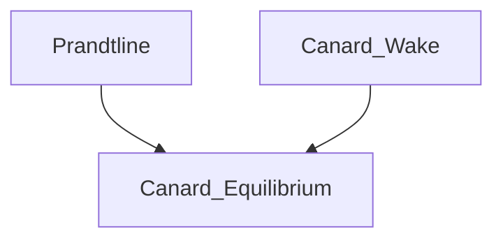

# Equilibrium C++ Instructions

The ```main.cpp``` is a c++ script that will execute all functions included inside the following
code:

```c++
int main(int argc, char** argv) {
    aerodes *aero = new aerodes(argc, argv);

    // prandtline process
    aero->prandtl->readInputParams("prandtline.data");
    aero->prandtl->readInputPolarMulti("wing_polarbl.dat"); // reads multiple polar files for main wing geometry (3 polars)
    aero->prandtl->setAlpha(0);          // set alpha (deg) // this overrides the input file
    aero->prandtl->setMesh();            // set wing discritization
    aero->prandtl->solveLiftingLine();
    
    // canar wake process
    aero->wk->readInputPolar("canar_polarbl.dat"); // polar file for canard geometry
    // ... more stuff
    
    // canar equillibrium
    aero->canary->init();
}
```

**Note:** The line ```aero->canary->init()``` communicates with the ```prandtline``` and ```wk``` objects and initializes the shared variables.



## Compiling The Example

In order to compile this code, so that we may run the resulting executable called ```test```, use this command.

```g++ -o test -laerolib main.cpp```

Now we may run the executable like so,

```./test```

