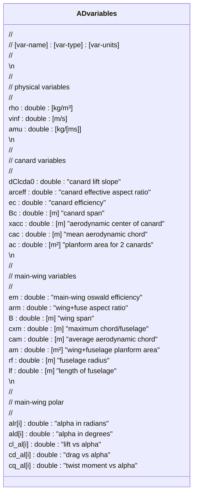
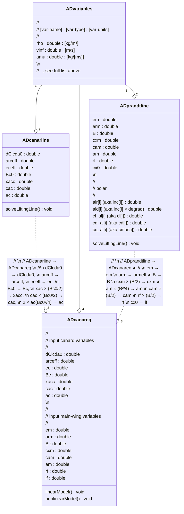

# Developer Notes

## 1. File Names

Here are a few notational rules to follow when creating new source files.

Core source-files should follow this naming convention, ```AD*.cpp```.


## 2. Transfer of information

Please commit this list of variables to memory and their definitions.



Internally this is how AeroDes modules share information between core-classes. 
The arrows indicate the transfer of information and normalization for certain variables.


